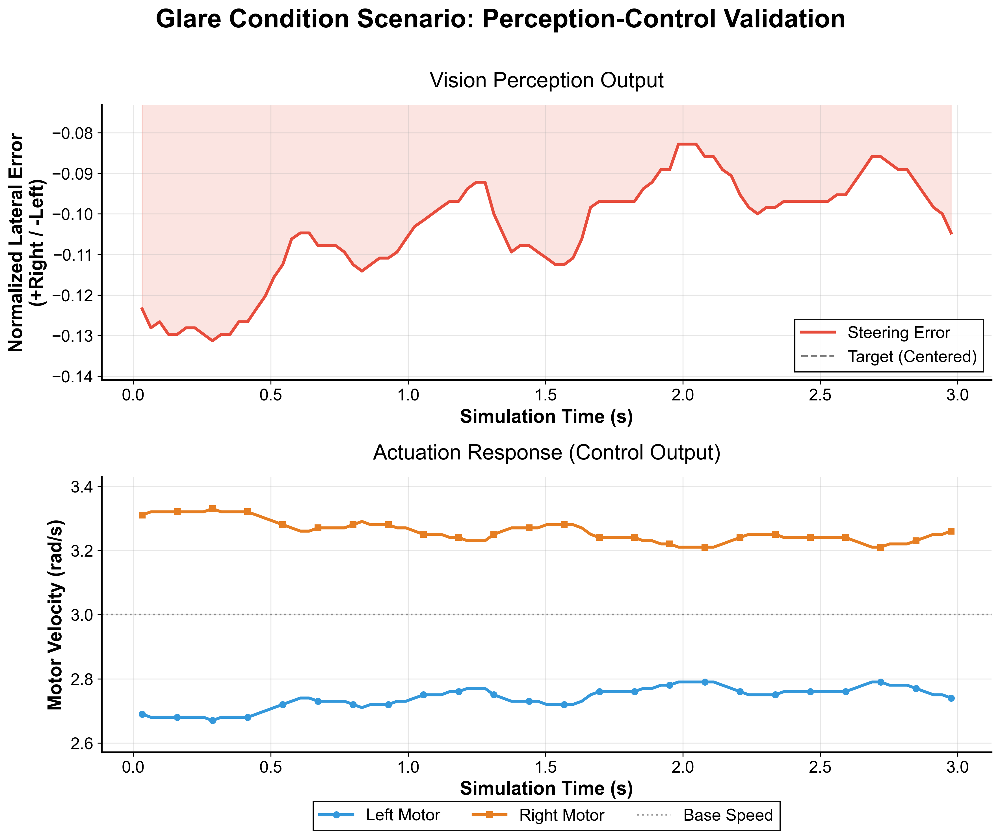
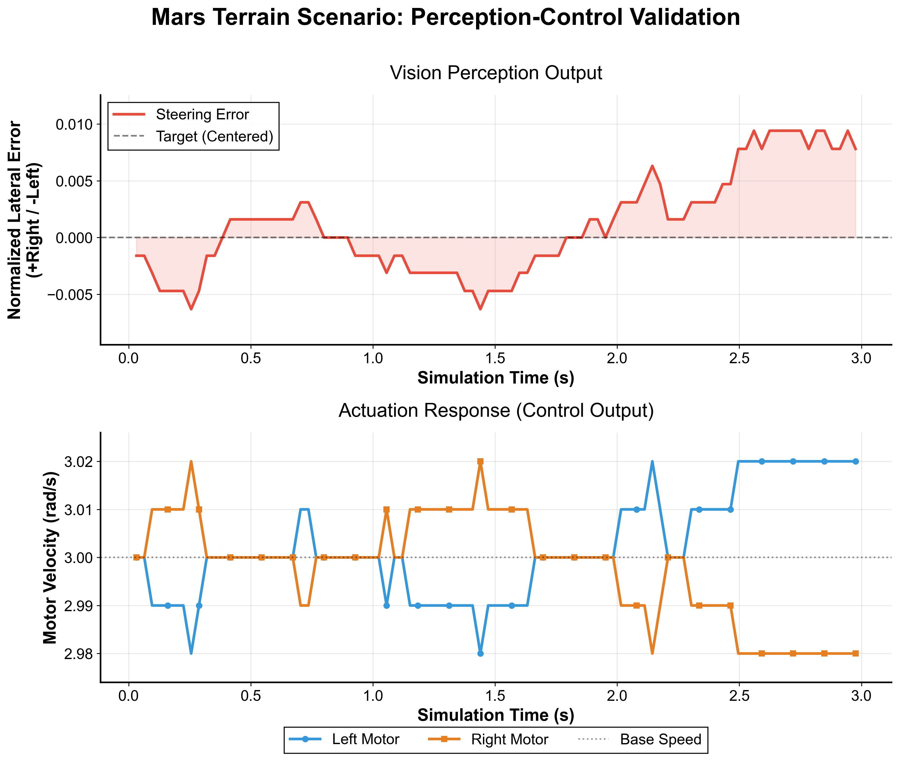
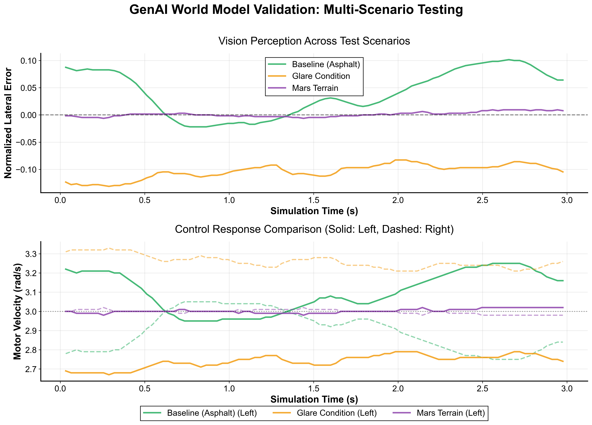
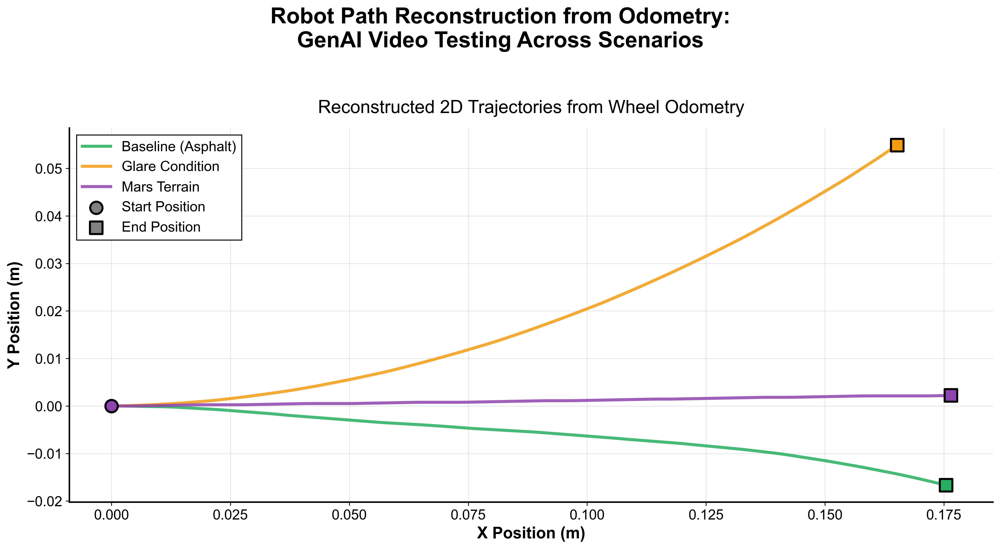

# Testing World Foundation Models for Robotic Vehicle Perception Validation

## Abstract

This work explores whether synthetic videos generated by world foundation models can serve as test environments for robotics perception algorithms. We implement a vision-based line-following controller for the e-puck robot platform in Webots simulation, feeding it pre-recorded videos from Nvidia's Cosmos Predict 2.5 model instead of live camera feeds. Three test scenarios are evaluated: baseline asphalt, high-glare reflections, and extreme domain shift (Mars-like terrain). The methodology demonstrates that foundation model-generated videos can be integrated into robotics simulation workflows, with telemetry data collected for quantitative analysis. This approach may provide a complementary tool for algorithm testing before physical deployment.

## 1. Introduction

### 1.1 World Foundation Models

World foundation models are AI systems that learn comprehensive representations of physical environments, including spatial relationships, temporal dynamics, and causal interactions. Unlike conventional video generation models that primarily focus on visual synthesis and aesthetic coherence, world models encode an understanding of underlying physics, object permanence, and environmental constraints. These models predict future states based on current observations and potential actions, making them particularly relevant for robotics applications where understanding physical causality is essential.

Nvidia defines world models as generative AI systems that "can predict how environments evolve over time based on given actions or inputs" ([Nvidia Glossary](https://www.nvidia.com/en-us/glossary/world-models/)). Foundation-scale implementations of these models are trained on massive datasets to capture generalizable world dynamics across diverse scenarios. This differs fundamentally from standard text-to-video generators (e.g., Sora, Gen-3) which optimize for visual plausibility rather than physical consistency or actionable predictions.

### 1.2 Motivation

Testing robotics perception algorithms traditionally requires physical hardware deployment or high-fidelity simulation environments, both of which present significant resource constraints. Recent advances in world foundation models (e.g., Nvidia Cosmos, Google Genie) raise the question: can synthetic video from these models provide useful test environments for perception validation?

### 1.3 Research Question

Can world foundation model-produced videos expose perception algorithm failure modes and provide meaningful performance metrics comparable to traditional testing approaches?

### 1.4 Approach

We test this hypothesis by implementing a standard vision-based line-following task using synthetic video inputs generated by Cosmos Predict 2.5, comparing performance across environmental conditions that stress the perception pipeline.

## 2. Methodology

### 2.1 Experimental Platform

**Robot Platform:** e-puck differential drive robot (Webots simulation)

**Control Frequency:** 32ms timestep (31.25 Hz)

**Sensor Modality:** Pre-recorded video (1280×720, 16 fps)

**Control Algorithm:** Proportional steering controller

### 2.2 Perception Pipeline

The vision system implements color-based segmentation for yellow line detection:

1. **Color Space Conversion:** BGR → HSV
2. **Thresholding:** HSV range [15,100,100] to [35,255,255]
3. **Centroid Calculation:** Image moments (M10/M00, M01/M00)
4. **Error Computation:** Normalized horizontal offset from image center

### 2.3 Control System

Differential drive control with proportional steering:

- Base velocity: 3.0 rad/s
- Proportional gain: 2.5
- Motor commands: `ω_left = v_base + K_p·error`, `ω_right = v_base - K_p·error`

### 2.4 Data Collection

Telemetry logged at each timestep includes:

- Simulation time (s)
- Frame number
- Steering error (normalized, [-1, +1])
- Left/right motor commands (rad/s)
- Left/right wheel odometry (m)

### 2.5 Experimental Conditions

Three test scenarios were designed to evaluate perception robustness:

1. **Baseline (path_asphalt.mp4)**
   - Standard asphalt road surface
   - Diffuse lighting conditions
   - High-contrast yellow line marking

2. **Glare (path_glare.mp4)**
   - Specular reflections on road surface
   - Challenging lighting with highlights
   - Tests sensitivity to environmental variation

3. **Mars (path_mars.mp4)**
   - Extreme domain shift scenario
   - Mars-like reddish terrain texture
   - Tests generalization beyond training distribution

### 2.6 Video Generation

Videos were generated using Nvidia Cosmos Predict 2.5 on University of Utah CHPC infrastructure:

- Model: `nvidia/Cosmos-Predict2.5-2B`
- Resolution: 1280×720 pixels
- Frame rate: 16 fps
- Duration: 121 frames (~7.5 seconds)
- GPU: NVIDIA H200 (71GB VRAM)

Each scenario used carefully engineered text prompts specifying camera position, motion dynamics, surface properties, and environmental conditions.

## 3. Results

Experimental data collection generated telemetry logs for all three test scenarios. The logged data captures steering error, motor commands, and odometry at each control timestep, stored in CSV format in the `data/` directory.

Visualization scripts process this telemetry to generate analysis figures showing temporal dynamics, trajectory reconstruction, and cross-scenario comparisons. All generated figures are available in the `figures/` directory.

### 3.1 Individual Scenario Analysis

Each test scenario produces a 4-panel visualization showing:

- Steering error over time
- Left/right motor commands
- Reconstructed trajectory from odometry
- Error distribution histogram

<div align="center">
  
  <p><em>Figure 1: Baseline scenario (asphalt road) - steering error, motor commands, trajectory, and error distribution</em></p>
</div>

<div align="center">
  
  <p><em>Figure 2: Glare scenario (high reflection) - steering error, motor commands, trajectory, and error distribution</em></p>
</div>

<div align="center">
  
  <p><em>Figure 3: Mars scenario (extreme domain shift) - steering error, motor commands, trajectory, and error distribution</em></p>
</div>

### 3.2 Cross-Scenario Comparison

<div align="center">
  
  <p><em>Figure 4: Overlaid comparison of steering error across all three scenarios</em></p>
</div>

<div align="center">
  
  <p><em>Figure 5: Odometry-based trajectory reconstruction comparing robot paths across scenarios</em></p>
</div>

### 3.3 Video Demonstration

A synchronized comparison video is available at `figures/comparison_video.mp4`, showing side-by-side playback of all three scenarios with real-time metrics overlay and live steering error plotting.

## 4. Discussion

### 4.1 Experimental Observations

This work demonstrates a methodology for testing robotics perception algorithms using world foundation model-generated video as input. The three test scenarios (baseline asphalt, high-glare reflections, and Mars terrain) were successfully generated using text-to-video synthesis and integrated into a Webots controller simulation.

Telemetry data was collected for all scenarios, enabling quantitative comparison of controller behavior across different environmental conditions. The visualization pipeline processed this data into temporal plots, trajectory reconstructions, and cross-scenario comparisons.

### 4.2 Methodological Limitations

1. **Temporal consistency** - World foundation models may produce frame-to-frame inconsistencies not present in real video
2. **Physics accuracy** - Motion dynamics and lighting physics may not match real-world constraints
3. **Limited video duration** - Short clips (~7 seconds) constrain long-term behavior analysis
4. **Prompt sensitivity** - Video quality depends heavily on prompt engineering expertise
5. **Domain-specific validation** - Results are specific to this line-following task and HSV-based segmentation approach

### 4.3 Potential Applications

This methodology could be applied to:

- Rapid generation of diverse test scenarios without physical environment construction
- Systematic exploration of environmental parameter space
- Early-stage algorithm testing before physical robot deployment

Analysis of the collected telemetry data would be required to draw specific conclusions about perception algorithm robustness across the tested scenarios.

## 5. Reproducibility

### 5.1 Software Requirements

- **Webots:** R2025a or compatible
- **Python:** 3.11+ (tested with 3.11.8)
- **Dependencies:** OpenCV (4.12.0.88), NumPy (2.2.6), Pandas (2.3.3), Matplotlib (3.10.7)

### 5.2 Installation

```bash
# Navigate to project directory
cd controllers/vision_controller

# Create virtual environment
python3 -m venv .venv
source .venv/bin/activate  # Linux/macOS
# .venv\Scripts\activate  # Windows

# Install dependencies
pip install opencv-python numpy pandas matplotlib
```

Note: The `controller` module is provided by Webots runtime.

### 5.3 Running Experiments

1. **Open Webots simulation:**

   ```text
   File → Open World → controllers/vision_controller/worlds/e-puck.wbt
   ```

2. **Configure test scenario in `vision_controller.py`:**

   ```python
   VIDEO_PATH = "videos/path_asphalt.mp4"  # Select scenario
   LOG_FILE = "data/data_baseline.csv"      # Output file
   ```

3. **Execute controller:**
   - Webots GUI: Robot → Edit Controller → Select `vision_controller` → Run
   - Or press Ctrl+5 (Windows/Linux) / Cmd+5 (macOS)

4. **Monitor execution:**
   - Webots 3D view: robot motion
   - OpenCV window: video + detection visualization
   - Terminal: telemetry logging status
   - Press 'q' to terminate

5. **Collect telemetry:**

   ```bash
   cat data/data_baseline.csv  # View logged data
   ```

Available scenario configurations:

- `path_asphalt.mp4` → `data_baseline.csv`
- `path_glare.mp4` → `data_glare.csv`
- `path_mars.mp4` → `data_mars.csv`

### 5.4 Generating Videos with Cosmos Predict 2.5

Video generation was performed on University of Utah Center for High Performance Computing (CHPC) infrastructure using Apptainer containerization.

**Computational Environment:**

- Container: Apptainer (11GB image)
- Base: nvidia/cuda:12.8.1-cudnn-devel-ubuntu24.04
- Python: 3.10.19
- PyTorch: 2.7.1+cu128
- GPU: NVIDIA H200 (71GB VRAM, MIG configuration)
- Model Cache: HuggingFace (30-40GB, auto-downloaded)

**Pre-built Container Locations (University of Utah CHPC):**

- Primary: `/scratch/general/vast/u1523034/cosmos/cosmos-predict25-working.sif`
- Backup: `/uufs/chpc.utah.edu/common/home/u1523034/containers/cosmos-predict25-working.sif`
- HuggingFace Cache: `/scratch/general/vast/u1523034/cosmos/hf-cache`

**GPU Allocation (SLURM):**

```bash
salloc -N 1 -n 12 -A <account> -p <partition> \
  --qos=<qos> --gres=gpu:h200_3g.71gb:1 \
  -t 2:00:00 --mem=64G
```

**Inference Execution:**

```bash
module load apptainer
export HF_HOME=/scratch/general/vast/u1523034/cosmos/hf-cache

apptainer exec --nv \
  --env HF_HOME=${HF_HOME} \
  -B /scratch/general/vast/u1523034/cosmos/outputs:/outputs \
  -B ${HF_HOME}:${HF_HOME} \
  /scratch/general/vast/u1523034/cosmos/cosmos-predict25-working.sif \
  /opt/cosmos-predict2.5/.venv/bin/python \
  /opt/cosmos-predict2.5/examples/inference.py \
  -i /path/to/input_config.json \
  -o /outputs/scenario_name
```

**Input Configuration Format:**

JSON files in `prompts/` directory specify generation parameters:

```json
{
  "prompt": "Low-angle ground-level camera view...",
  "num_frames": 121,
  "fps": 16,
  "height": 720,
  "width": 1280
}
```

Prompt engineering considerations: camera geometry (height, FOV), motion dynamics (speed, trajectory), scene properties (surface texture, lighting), and target features (line width, color, contrast).

**File Transfer:**

```bash
scp user@chpc-host:/outputs/scenario/*.mp4 ./videos/
```

### 5.5 Data Analysis

**Generate visualizations:**

```bash
python create_plots.py                # Individual scenario analysis
python create_additional_plots.py     # Cross-scenario comparison
python create_comparison_video.py     # Synchronized video with metrics
```

**Output artifacts:**

- `figures/[scenario]_perception_control.png` - 4-panel analysis (error, commands, trajectory, distribution)
- `figures/combined_scenario_comparison.png` - Overlaid comparison
- `figures/trajectory_comparison.png` - Odometry paths
- `figures/comparison_video.mp4` - Side-by-side synchronized playback

## 6. Implementation Details

### 6.1 Video Integration Pattern

The controller uses OpenCV `VideoCapture` to read pre-recorded video files rather than Webots camera devices. This design choice enables testing with externally generated videos without simulation environment modifications.

### 6.2 Error Handling

- **End of video stream:** Triggers clean shutdown via `close_and_exit()`
- **Detection failure:** Controller maintains previous steering command (error = 0.0)
- **Manual termination:** User presses 'q' in visualization window

### 6.3 Webots Constraints

Standard `Robot` controllers lack simulator control authority (reserved for `Supervisor` nodes). The implementation avoids `simulationSetMode()` calls that would cause runtime errors.

## 7. Project Structure

```text
vision_controller/
├── vision_controller.py           # Main controller implementation
├── worlds/e-puck.wbt              # Webots simulation world
├── videos/                        # Input: Cosmos-generated videos
│   ├── path_asphalt.mp4
│   ├── path_glare.mp4
│   └── path_mars.mp4
├── prompts/                       # Video generation configurations
│   ├── path_asphalt.json
│   ├── path_glare.json
│   └── path_mars.json
├── data/                          # Output: Telemetry logs
│   ├── data_baseline.csv
│   ├── data_glare.csv
│   └── data_mars.csv
├── figures/                       # Output: Visualizations
│   ├── baseline_perception_control.png
│   ├── glare_perception_control.png
│   ├── mars_perception_control.png
│   ├── combined_scenario_comparison.png
│   ├── trajectory_comparison.png
│   └── comparison_video.mp4
├── create_plots.py                # Visualization: Individual scenarios
├── create_additional_plots.py     # Visualization: Comparisons
├── create_comparison_video.py     # Visualization: Synchronized video
└── test_frame_generation.py       # Utility: Frame extraction
```

## 8. References

- **Webots Documentation:** <https://cyberbotics.com/doc/>
- **Nvidia Cosmos Predict 2.5:** <https://docs.nvidia.com/cosmos/latest/predict2.5/>
- **Model Repository:** <https://huggingface.co/nvidia/Cosmos-Predict2.5-2B>
- **University of Utah CHPC:** <https://www.chpc.utah.edu/>

---

**Software Versions:** Webots R2025a, Python 3.11.8
**Last Updated:** December 2025
